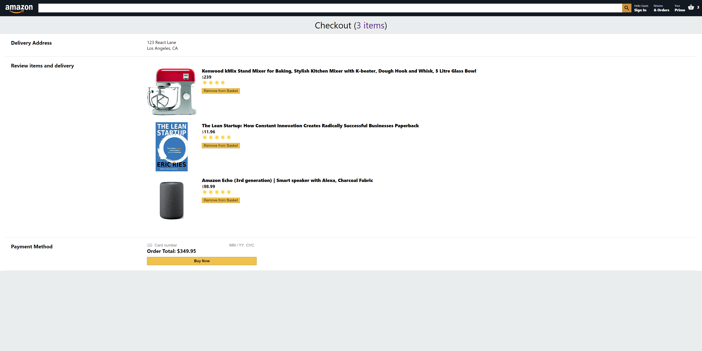

# Amazon E-Commerce Web App Clone!

### About
A full stack web project I made to replicate the look and functionality of Amazon’s ecommerce website. The front end web app was built with React, and the back end was made with Firebase + Cloud Firestore. A live version of the app can be visted here: https://challenge-91043.web.app/ 

### Tools + Tech
- React
- Redux
- Firebase
- Cloud Fire Store
- Stripe Payment Processing API

### Features
- Dynamic items feed
- Account creation with validation, and user login and authentication
- Persistent shopping basket and user state with Redux
- Add and remove items from the basket
- Automatic price summation for basket items
- Working checkout and credit card payment system, powered by Stripe. 

### Screenshots

